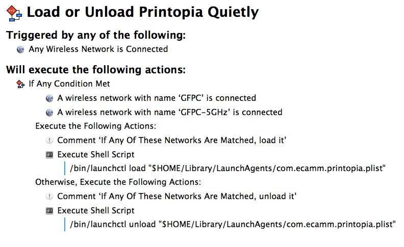

auto-printopia
==============

Automatically load or unload Printopia based on Wi-Fi network (SSID)

[Rose Orchard](https://plus.google.com/u/0/+RoseOrchard/posts/LQhjW4LBJiN?cfem=1) asked:

> I'm wondering if anyone can help me with automating Printopia. Essentially when I connect to certain networks (my personal ones) I would like Printopia to run, and whenever I connect to anything else I would like to turn it off. I have tried Applescript and got nowhere, and the same with Keyboard Maestro.
>
> Does anyone have some advice that may be able to help? Essentially I need two "ifs" - Network name (is/is not) and the status of Printopia...
>

The "trick" here is that Printopia is being forcibly kept alive (well, actually, it's automatically restarted every time it stops or quits) by `launchd`.

In order to keep Printopia "off" you have to "unload" its launchd plist:

	/bin/launchctl unload "$HOME/Library/LaunchAgents/com.ecamm.printopia.plist"

To make it active again,

	/bin/launchctl load "$HOME/Library/LaunchAgents/com.ecamm.printopia.plist"

The key is automating it. There are several ways of doing it. The easiest is [Keyboard Maestro][]:

Just change the wireless network names depending on which one you want to control. You can
[download the Keyboard Maestro macro here](printopia.kmmacros.zip)

[Keyboard Maestro]: http://www.keyboardmaestro.com/main/

### The Hard Way

The harder way is to have a `launchd` script which looks for network changes. The easiest way that I know of to do this is to have your `launchd` plist watch this folder for changes:

	<key>WatchPaths</key>
	<array>
		<string>/Library/Preferences/SystemConfiguration/</string>
	</array>

Instead of having several of these scripts which run whenever `/Library/Preferences/SystemConfiguration/` changes, I have one called `on-network-change.sh`:

	<key>Program</key>
	<string>/usr/local/bin/on-network-change.sh</string>

And the first thing it does is check to see if the SSID has actually changed since the last time it ran (by saving the SSID to /tmp/SSID.txt and comparing it) which minimizes the impact of having the script run too often, or having 10 scripts that run every time that folder changes.

If you want to see how I'd do that, see [auto-printopia.sh](auto-printopia.sh) which should be saved to `/usr/local/bin/auto-printopia.sh` and [com.tjluoma.auto-printopia.plist](com.tjluoma.auto-printopia.plist) which should be saved to `~/Library/LaunchAgents/com.tjluoma.auto-printopia.plist`.

(If you put `auto-printopia.sh` anywhere other than `/usr/local/bin/auto-printopia.sh` be sure to update the path in `com.tjluoma.auto-printopia.plist`.)

I think [auto-printopia.sh](auto-printopia.sh) should be self-explanatory if you read the code and the comments, but if not, feel free to drop me an email (mine is inside the script).

p.s. - “Rose Orchard” is an awesome name.

